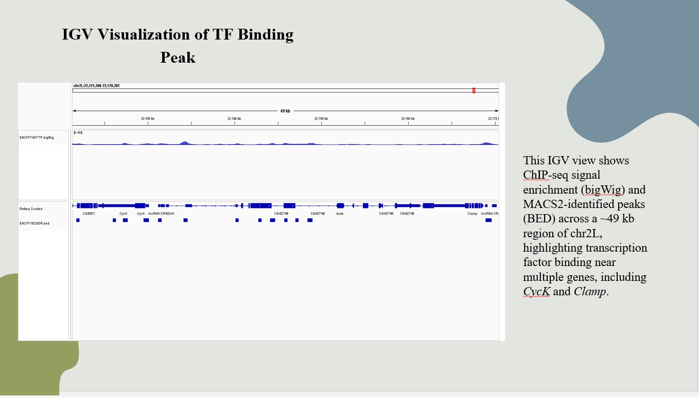
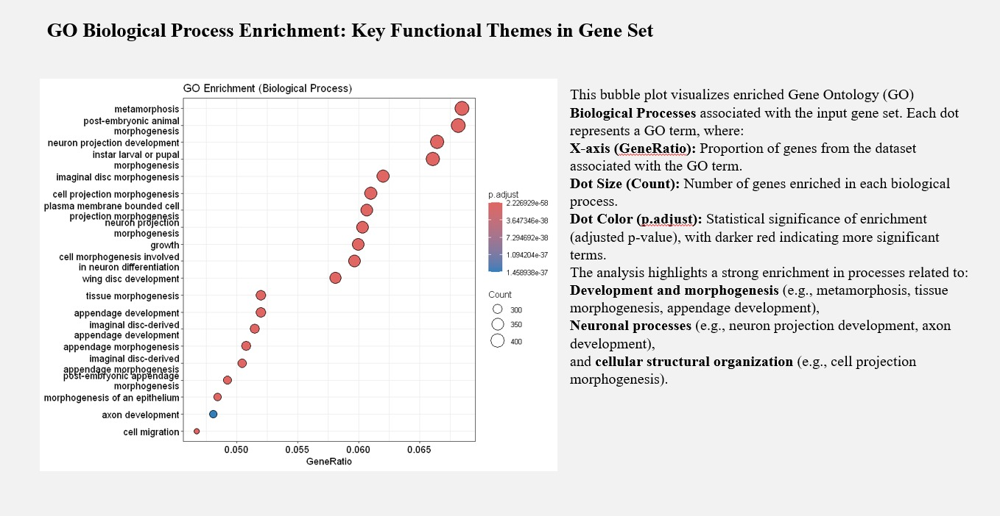

# ChIP-seq Analysis Pipeline

This repository contains a complete ChIP-seq analysis workflow starting from raw sequencing reads to peak calling and downstream analysis.
<br>
The pipeline was implemented and executed in a Linux (WSL) environment using standard bioinformatics tools.<br>


## Workflow Overview

1. **Quality Control**
   - Raw reads assessed using FastQC
   - Quality reports generated before and after trimming

2. **Read Trimming**
   - Adapter and low-quality base removal
   - Post-trimming QC performed

3. **Read Alignment**
   - Reads aligned to the reference genome using BWA
   - Sorted and indexed BAM files generated

4. **Peak Calling**
   - Peaks identified using MACS2
   - NarrowPeak, summit, and annotation files produced

5. **Peak Annotation & Analysis**
   - Peaks annotated to nearby genes
   - Downstream biological interpretation


## Repository Structure

```text
Chip_Seq/
├── fastqc/            # QC reports (HTML)
├── trim/              # Trimmed reads
├── bwa/               # Alignment files
├── macs2_results/     # Peak calling outputs
├── pipeline/          # Pipeline documentation (PPT)
└── README.md

## Pipeline Documentation

l**Detailed step-by-step pipeline presentation:**  
[ChIP-seq Analysis Pipeline (PPT)](pipeline/Chip_Seq.pptx)


---

# Reference Genome
The analysis was performed using the following reference genome:
**hg38**  
  https://hgdownload.soe.ucsc.edu/goldenPath/hg38/

  ## Results

### Peak Distribution


### IGV Visualization


### Functional Annotation

